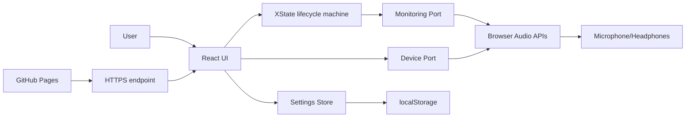

# SYSTEM_ANALYSIS.md

## System Boundary
AuMonitor is a browser application that depends on:
- Browser media APIs (`getUserMedia`, `AudioContext`, optional `setSinkId`)
- OS-level input/output device routing
- User permissions and interaction timing
- Static hosting availability (GitHub Pages)

## System Map

## Key Feedback Loops
1. Monitoring loop (fast, reinforcing):
- Audio samples -> metrics -> user action (stop/change mode/device) -> new session behavior.

2. Warning loop (balancing):
- API/hardware anomaly -> warning message -> user fixes device/settings -> stability improves.

3. Device-change loop (stabilized):
- Hardware change -> device list refresh -> preference reconciliation -> deterministic session restart.

## Single Points of Failure
1. Lifecycle synchronization between UI effects and state-machine transitions.
2. Browser security context (if HTTPS is broken, microphone flow is blocked).
3. Device API variability across browsers/hardware vendors.
4. GitHub Actions / Pages availability during release window.

## Current Risk Focus
1. Preserve lifecycle stability under rapid user actions.
2. Keep Pages deploy path minimal and deterministic.
3. Maintain regression coverage for prior P0/P1 bugs.

## Leverage Points
1. Keep start/stop ownership logic and stale-session cleanup.
2. Keep deterministic reconfigure flow for mode/input/device changes.
3. Keep release process simple: one branch (`main`), one deploy workflow.

## Analyst Recommendations
1. Avoid reintroducing extra infra layers until backend/runtime requirements appear.
2. Keep deployment docs centered on Pages flow and rollback-by-revert.
3. Validate smoke checks after each production publish.
